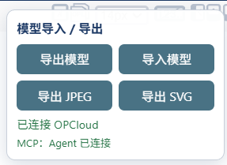

# OPCloud Bridge

[简体中文](./README.md) | [English](./README.en.md)

为 [OPCloud Sandbox](https://opcloud-sandbox.web.app/) 增加本地模型导入、导出功能，并允许 Codex、Claude 等 Agent 通过 MCP 操作当前浏览器中的模型。

安装后，OPCloud 页面右下角会显示“模型导入 / 导出”面板。模型文件只在本地浏览器中处理，不会上传到其他服务器。

## 在线一键安装

先安装 [Tampermonkey](https://www.tampermonkey.net/) 或 [Violentmonkey](https://violentmonkey.github.io/)，然后点击：

### [➡️ 一键安装 OPCloud Bridge](https://raw.githubusercontent.com/Du0yu/OPCloud-Bridge/main/opcloud-model-io.user.js)

用户脚本管理器会自动打开安装确认页。脚本内置更新地址，发布更高版本后可由用户脚本管理器自动检查更新。

## 功能



- 将当前完整模型导出为 `.opcl` 文件
- 导入 `.opcl` 或兼容的 `.json` 文件
- 将当前 OPD 导出为 2× 分辨率 JPEG
- 将当前 OPD 导出为可缩放的 SVG
- 将当前模型生成的 OPL 保存为本地 UTF-8 文本文件
- 导入后自动重建 OPD、导航树和 OPL
- 覆盖已有模型前进行确认
- 自动适配 OPCloud Webpack 模块编号变化
- 附带一个可直接导入的两菜晚餐示例模型
- 提供本地 MCP Server，支持 Agent 读取、导入、校验模型以及读取 OPL、导出图像
- 油猴脚本自动连接本机 MCP 桥，无需修改 OPCloud 网站
- 插件界面支持中文和英文：首次自动跟随浏览器语言，也可点击面板中的 `EN / 中文` 手动切换

## 自动保存与撤回

右下角面板会自动把完整模型保存到浏览器本地存储，并显示保存时间。编辑结束后约 250 毫秒记录快照，另有每秒检查作为补充；连续快速编辑可能合并为一步。“撤回上一步”恢复前一个完整模型快照，支持手动导入、Agent 导入和备份恢复。历史仅保留在当前页面内，最多 30 步，并按大小限制内存占用；刷新后撤回历史清空。

从 1.8.1 起，备份及其名称、保存时间均持久化在 `localStorage` 中。刷新页面或关闭浏览器后重新打开同一浏览器、同一用户配置下的 OPCloud，都会扫描本地备份，包括 1.8.0 已保存的记录，无需原来的标签页会话 ID。在下拉列表选择模型后点击“恢复备份”，或点击“保留当前模型”继续编辑当前画布；选择前暂停自动保存。也可随时点击“本地备份”重新打开列表。

每次打开或刷新页面都使用独立的写入记录，复制标签页也不会共用写入记录。恢复备份或保留当前画布后，后续保存写入当前页面的记录，旧会话备份仍保留。备份不会自动清理，存储被禁用或空间不足时面板会显示错误，内存中的撤回仍可使用。清除网站数据、更换浏览器或使用无痕模式可能导致备份不可用，重要模型仍应导出 `.opcl`。自动保存不会下载文件或上传到服务器。

## Agent / MCP 模式

整体连接方式如下：

```text
Codex / Claude / MCP Client
          ↕ MCP stdio
每个对话独立的 MCP 进程
          ↕ 本机 IPC
共享 OPCloud Bridge 服务
          ↕ WebSocket（127.0.0.1:17373）
油猴脚本 ↔ OPCloud 页面
```

多个 MCP 会话通过本机 IPC 共用一个浏览器桥接服务，避免争抢 17373 端口。关闭一个会话不会断开其他会话；最后一个会话关闭 30 秒后，共享服务自动退出。会话仍在运行时会自动恢复意外退出的共享服务。工具注册不依赖浏览器连接；连接不可用时，`opcloud_status` 会返回诊断信息。浏览器操作按到达顺序执行，断开的请求不会自动重放。

### MCP 客户端配置

安装油猴脚本后，可让 MCP 客户端直接从 GitHub 启动桥接程序：

```json
{
  "mcpServers": {
    "opcloud": {
      "command": "npx",
      "args": ["-y", "github:Du0yu/OPCloud-Bridge"]
    }
  }
}
```

部分 Windows 客户端需要将 `command` 写成 `npx.cmd`。配置完成后重启 MCP 客户端，并打开或刷新 [OPCloud Sandbox](https://opcloud-sandbox.web.app/)。右下角出现“`MCP：本地桥接已连接`”即连接成功。

也可以克隆仓库并在本地运行：

```bash
npm install
npm start
```

本地源码模式下，在 MCP 配置中将命令设为 `node`，参数设为 `mcp-server/server.js` 的绝对路径。

使用 Codex CLI 可以直接登记本地源码版本：

```powershell
codex mcp add opcloud -- node "C:\path\to\OPCloud-Bridge\mcp-server\server.js"
codex mcp get opcloud
```

请将 `C:\path\to\OPCloud-Bridge` 替换为你克隆本仓库后的实际绝对路径。

登记后请新建一个 Codex 会话。MCP Server 会由 Codex 自动启动，不需要同时手动运行 `npm start`。随后打开或刷新 OPCloud；油猴面板显示“`MCP：本地桥接已连接`”即表示浏览器桥已接通。

### 重启桥接与工具加载排障

1.6.1 将每个排队请求绑定到接收时的浏览器连接；切换标签页或重连后，旧请求会报错，必须重新读取当前模型再重试。MCP 取消及超时会取消尚未执行的操作。已经开始的原生操作无法保证撤销，服务会等待其结束再执行下一条；浏览器端也会串行处理跨重连的操作。如果原生操作一直不返回，可能需要刷新 OPCloud 页面，刷新前请保存模型。

从 1.6.0 升级时，更新油猴脚本并刷新页面，然后退出所有连接此桥接的 MCP 客户端，等待至少 30 秒让共享服务退出，再重新打开客户端。只快速重启一个 MCP 会话可能继续复用旧版共享服务。

页面右下角的“重启桥接”会关闭旧 WebSocket、清除重试等待并立即重新连接，保留当前模型。此按钮重启的是浏览器连接，不能启动本地 Node 进程或重新加载 Codex 的工具列表。多个 OPCloud 标签页中，最新连接的页面接管桥接；被替换的页面暂停自动重连，可点击“重启桥接”切回。

从 1.5.x 升级时，先更新油猴脚本并刷新页面，再在 MCP 客户端中重启 `opcloud` 服务（必要时重启客户端），让旧版独占端口的进程退出。只更新磁盘文件不会替换已运行的旧进程。

如果工具没有自动加载，检查 MCP 客户端是否成功启动并发现 `opcloud` 工具。旧版会在注册工具前因 `EADDRINUSE` 退出；新版先注册全部工具，再连接共享服务。若 `opcloud_status` 提示旧进程占用端口，应先确认该进程确实是旧桥接服务，再退出它。页面显示“本地桥接已连接”仅代表浏览器与桥接服务连通，不代表当前对话已经加载工具。

### 连接测试

在新 Agent 会话中依次调用：

1. `opcloud_status`：应返回 `connected: true` 和 `opcloud.ready: true`；
2. `opcloud_get_model`：应能读取当前模型、OPD 和 logical elements；
3. `opcloud_get_opl`：应能读取当前模型生成的 OPL；
4. `opcloud_review_diagram`：应同时返回模型摘要、OPL 和 MIME 类型为 `image/jpeg` 的实际画布图像。

项目已使用空白 OPCloud 模型完成过一次端到端实测：油猴脚本成功连接本机 WebSocket，Agent 读取到 `Model (Not Saved)`、空 OPL，以及与空模型一致的白色 JPEG 画布。

### MCP 工具

从 1.7.0 起，不需要客户端能直接读取本仓库，MCP 就能提供建模规则和完整模板。初始化说明和导入工具说明都会提示 Agent 生成前先读取以下两个工具；是否自动遵循仍取决于客户端和模型。服务端会独立拦截不支持的元素类别、链接类型/类别、明显错误的端点方向和状态归属。校验通过不代表 OPM 领域语义、布局或 ISO 合规已经验证。

1.7.1 增加了 [ISO 19450:2024 条款与实现对照表](docs/iso-19450-2024-coverage.md)，建模指南工具也会返回其全文。Agent 限于人或人群，其系统内/环境归属由场景决定；程序不会通过名称猜测它是否为人。Effect 检查完整模型的原生状态证据，具体变化含义仍需审阅。校验返回 `semanticChecks`、`requiresSemanticReview` 和 `isoConformance: "not_assessed"`；`valid: true` 仅代表已实现的错误检查通过。没有可识别状态证据时，导入会被桥接规则拦截；不透明的隐藏状态记录保留并明确要求人工审阅。这些规则不是完整的 ISO 符合性评估，也不会自动更新前端手动文件导入的轻量校验器。

| 工具 | 用途 |
|---|---|
| `opcloud_get_modeling_guide` | 获取完整 AGENTS.md 建模指南、支持类型和验证边界；无需连接浏览器 |
| `opcloud_get_model_template` | 获取完整原生 OPCL 导出模板，保留元数据及全部元素字段；无需连接浏览器 |
| `opcloud_status` | 检查油猴脚本、网页和模型是否就绪 |
| `opcloud_get_model` | 读取当前完整模型 JSON |
| `opcloud_import_model` | 将完整 JSON/OPCL 模型载入当前页面 |
| `opcloud_get_opl` | 获取 OPCloud 生成的 OPL sentences |
| `opcloud_validate_model` | 检查 JSON、ID、OPD、状态父对象及连线引用 |
| `opcloud_export_image` | 将当前 OPD 返回为 JPEG 或 SVG |
| `opcloud_review_diagram` | 一次返回模型摘要、OPL 和当前 OPD 的实际 JPEG，供 Agent 看图审阅 |

当当前画布非空时，`opcloud_import_model` 必须显式传入 `replaceExisting: true`，避免 Agent 意外覆盖模型。

推荐让 Agent 按以下闭环执行：

```text
读取建模指南和原生模板 → 检查连接并保存当前模型 → 生成或修改 → 校验 → 导入 → 读取 OPL + 实际导出图像 → 修正 → 再次导入和审阅
```

`opcloud_review_diagram` 返回的是 OPCloud 当前画布通过原生 `toJPEG()` 生成的图像，而不是根据 JSON 重新绘制的近似图。支持图像输入的 MCP 客户端会把该 JPEG 直接交给 Agent，因此 Agent 可以检查元素遮挡、文字裁切、状态位置、连线交叉和遗漏元素。

## 安装

### 方法一：从 Git 托管平台安装

1. 在浏览器中安装 [Tampermonkey](https://www.tampermonkey.net/) 或 [Violentmonkey](https://violentmonkey.github.io/)。
2. 点击[一键安装链接](https://raw.githubusercontent.com/Du0yu/OPCloud-Bridge/main/opcloud-model-io.user.js)。
3. 用户脚本管理器会弹出安装页面，选择“安装”。
4. 打开或刷新 [OPCloud Sandbox](https://opcloud-sandbox.web.app/)。

### 方法二：本地安装

1. 打开用户脚本管理器，选择“添加新脚本”。
2. 将 [`opcloud-model-io.user.js`](./opcloud-model-io.user.js) 的全部内容粘贴进去。
3. 保存并刷新 OPCloud 页面。

## 使用

### 切换界面语言

插件首次运行时会根据浏览器首选语言显示中文或英文。点击面板标题右侧的 `EN` 或 `中文` 可手动切换；选择会保存在当前站点的浏览器本地存储中。

### 导出模型

1. 在 OPCloud 中完成或修改模型。
2. 点击页面右下角的“导出”。
3. 浏览器会下载一个格式化的 `.opcl` 文件。

### 导入模型

1. 点击页面右下角的“导入”。
2. 选择 `.opcl` 或兼容的 `.json` 文件。
3. 如果当前画布已有内容，确认是否替换。

### 导出图像

- 点击“导出 JPEG”下载当前 OPD 的 2× 分辨率位图。
- 点击“导出 SVG”下载当前 OPD 的矢量图；包含背景图片时优先使用 SVG。

### 保存 OPL

点击“保存 OPL”会读取 OPCloud 为当前模型生成的 OPL，并下载为 UTF-8 编码的 `.opl.txt` 文件。文件名包含模型名称和当前 OPD 名称。

可以先用 [`examples/Two-Dish-Dinner-Corrected.opcl`](./examples/Two-Dish-Dinner-Corrected.opcl) 测试导入。

## 本地校验

使用 Node.js 20 或更高版本安装依赖并运行：

```bash
npm install
npm test
```

该命令检查用户脚本和 MCP Server 语法，并验证示例 OPCL 的 JSON、ID、OPD、状态父对象和连线引用。

## 工作原理

脚本复用 OPCloud 自己的模型接口：

- 导出调用模型的 `toJson()`。
- 导入调用模型的 `fromJson()`。
- 导入后调用 OPCloud 原生的树导航和图形渲染流程。
- MCP Server 使用标准输入输出与 Agent 通信，再通过本机 WebSocket 将工具调用转发给油猴脚本。

由于这些是站点内部接口，如果 OPCloud 将来进行较大的前端重构，脚本可能需要同步更新。

## Agent 使用说明

如果使用编码 Agent 生成或修改 JSON/`.opcl`，请让 Agent 先阅读 [`AGENTS.md`](./AGENTS.md)。它要求 Agent 交付可直接导入的完整文件，并定义了 OPCloud JSON 引用规则、OPM 连线枚举、状态转换方式、OPL 对应句式和提交前校验流程。

## 隐私

- 不包含统计或遥测代码。
- 普通导入、导出模式不发送网络请求。
- MCP 模式只连接 `127.0.0.1:17373`，不会把模型上传到远程服务器。
- 本地 WebSocket 只接受来源为 `https://opcloud-sandbox.web.app` 的浏览器连接。
- MCP 服务只监听回环地址，不接受局域网或公网连接。

## License

[MIT](./LICENSE)
